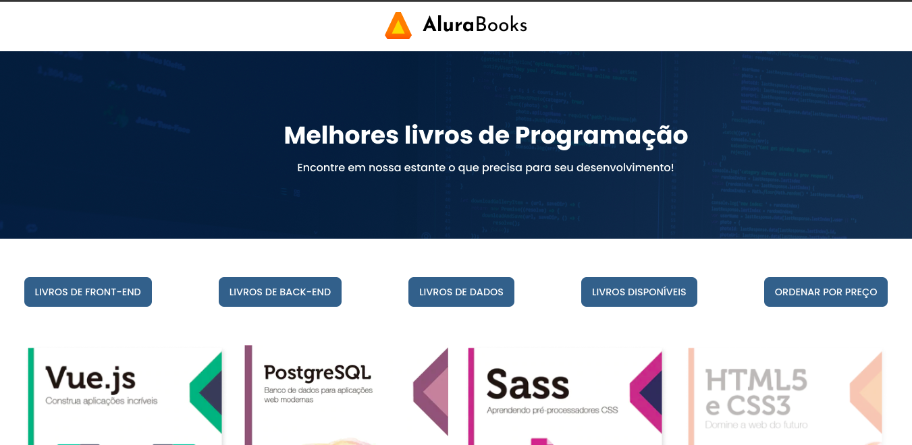

<h1 align="center">Alura - Books</h1>

Projeto desenvolvido para aplicar metódos array.

  <a href="#-tecnologias">Tecnologias</a>&nbsp;&nbsp;&nbsp;|&nbsp;&nbsp;&nbsp;
  <a href="#-projeto">Projeto</a>&nbsp;&nbsp;&nbsp;|&nbsp;&nbsp;&nbsp;
  <a href="#-layout">Aplicação</a>&nbsp;&nbsp;&nbsp;|&nbsp;&nbsp;&nbsp;
  <a href="#memo-licença">Licença</a>

  

 

  

## 🚀 Tecnologias

Esse projeto foi desenvolvido com as seguintes tecnologias:

- HTML 5
- CSS 3
- Javascript

## 💻 Projeto

Projeto Alura Books realizado requisição de API e aplicado métodos array para facilitar retorno dos dados para o usuário.

## 🔖 Aplicação

Você pode visualizar a aplicação do projeto através [DESSE LINK]()

## :memo: Licença

Esse projeto está sob a licença MIT.

---

Feito com ♥ by [Gisele Araujo Silva](https://www.linkedin.com/in/gisele-araujo-silva/)
